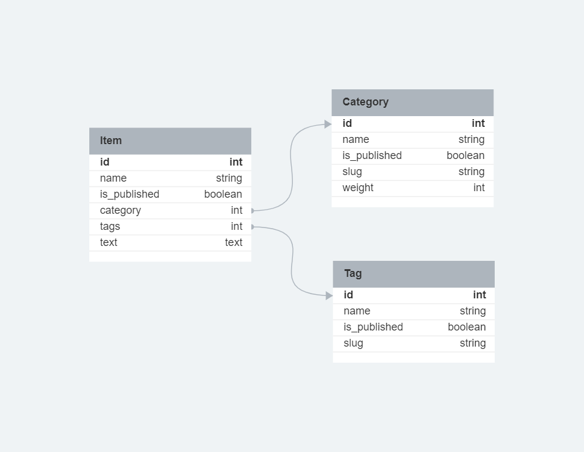

Перед началом работы откройте файл example.env, поменяйте значения переменных
при необходимости и сохраните этот файл под названием ".env"

## Структура базы данных


## Активация виртуального окружения
# установка виртуального окружения
```bash 
python3 -m venv venv 
```

# активация
```bash 
source venv/bin/activate # для linux
```
```bash 
venv/Scripts/activate.bat # для windows
```

## Установка необходимых пакетов
```bash
python3 -m pip install --upgrade pip
```
```bash
pip3 install -r requirements/prod.txt # основные зависимости
```
```bash
pip3 install -r requirements/dev.txt # зависимости для разработки
```
```bash
pip3 install -r requirements/test.txt # зависимости для тестов
```

## Динамический перевод
```bash
python manage.py makemessages -l en # сохранить
```
```bash
python manage.py compilemessages -l en # компилируем
```

## Бейджик
[](https://gitlab.crja72.ru/django/2024/spring/course/students/159819-treninasonya-course-1112/-/commits/main)

## Запуск тестов
```bash
cd lyceum # перейти в директорию lyceum
```
```bash
python3 manage.py test
```

## Запуск сервера
```bash
python3 manage.py runserver
```

